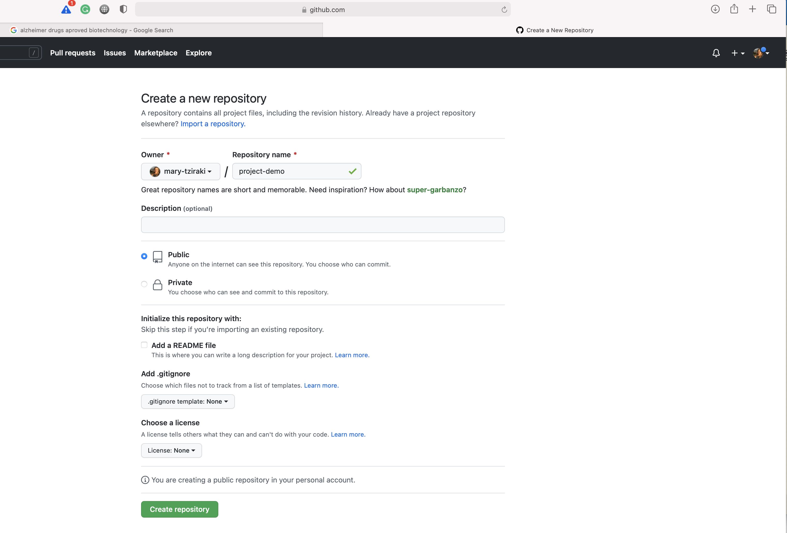
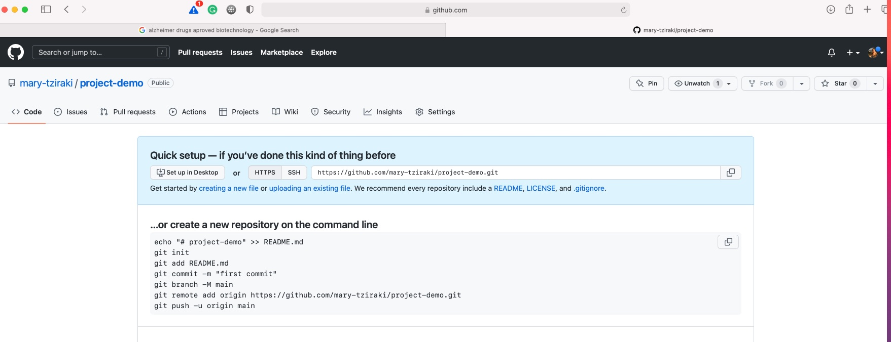
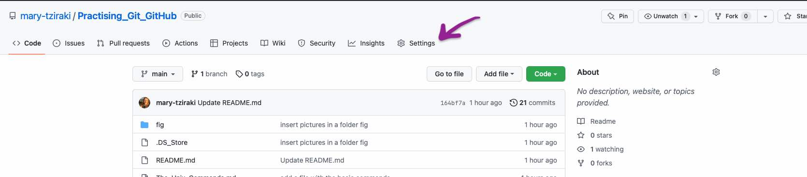
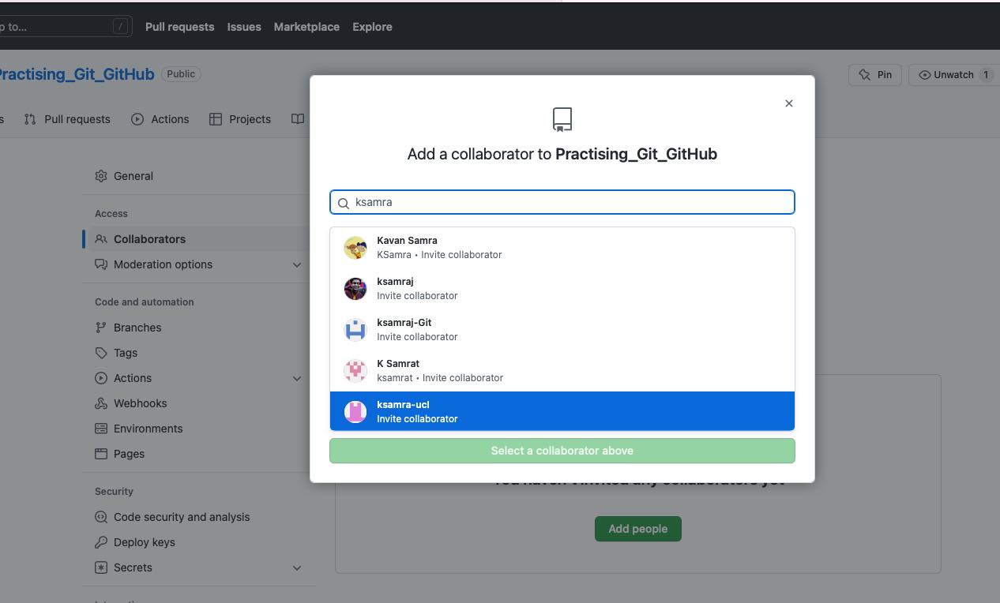
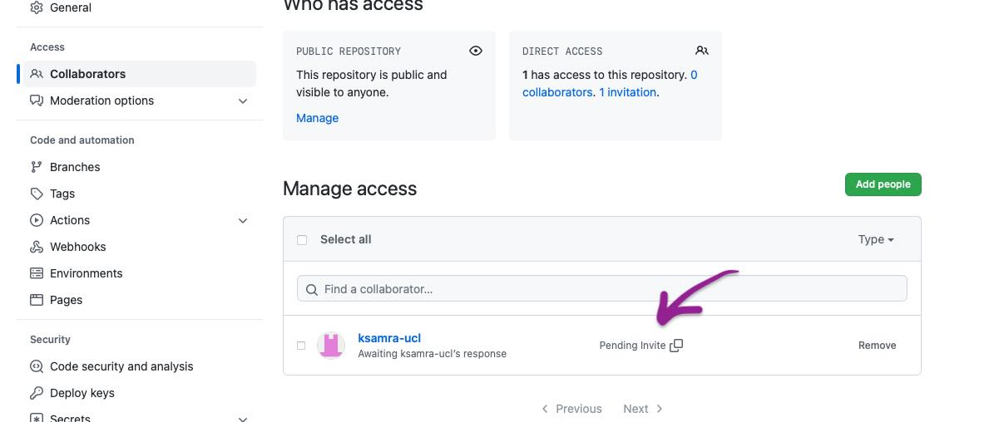

#How to connect git with GItHub

Here I demonstrate how to connect git and GitHub.
The repositories in the GitHub always have git in them!

If you have followed the demonstration (in git_command_line.md) of creating a project file in your local, initiation git and making versions of the files go to paragraph 1)

If you want to connect a GitHub repository - remote repository to your computer and make a - local repository go to paragraph 2)

All the explanations are in the pages of GitHub docs.
[Importing your projects GitHub](https://docs.github.com/en/get-started/importing-your-projects-to-github/importing-source-code-to-github/).


## 1) Send  your local git repository to GitHub.

At your GitHub Account create a new repository and don't add anything in it. 



I call it project-demo.

Go into it and copy the HTTPS



Then move to your terminal into the directory you want to **push** onto the GitHub and use the following command 

 ```
 $ git remote add origin <REMOTE_URL>
# Sets the new remote
```
After that you need to be sure that the remote URL is connected  and the "origin" now is the GitHub repository 
```
$ git remote -v
# Verifies the new remote URL
```

Then  you need to push your local repository to the GitHub

```
$ git push -u origin main
# Pushes the changes in your local repository up to the remote repository you specified as the origin
```


## 2) When you want to bring a remote repository into your computer.

You have created a repository in your GitHub or and you want to "download" it into your computer.

The GitHub repository is a git repository. So when  you hav eit in your machine you don't need to initiate the git.
If you type **ls -aF** or **ls -a** you will see the .git directory.

What you need to do is to go to the GitHub account find the repository you want to download and select from the green Code tab the SSH url

Then go to your local machine, open the terminal and write the following command 

```
git clone git@github.com:mary-tziraki/Practising_Git_GitHub.git 
# Makes a  clone of the external repository in a local directory
```
Then go to the local repository and move into it 

```
$ cd Practising_Git_GitHub.git
```

You can make any changes and push them to the remote.

Its good to verify what is your remote 

```
$ git remote -v
# Verifies the new remote URL
```

You make changes and you push and pull.


## 3) Add collaborators 

At your repository go to the settings tab 



and at the left side there under General there is a **Collaborators** tab. Click and then add collaborators by clicking the green **Add people**



Once you added an email is sent to your collaborator and She/he needs to accept the invitation!

Until accepted you cannot work together



The invite is pending until your collaborator accepts it 
You can also remove your collaborators.
Your collaborator need to clone your repository into their local machine.

send them your SSH url, or they can find it and they will clone 
```
git clone git@github.com:mary-tziraki/Practising_Git_GitHub.git 
# Makes a  clone of the external repository in a local directory
```

Now that you are collaborating you can change the files either on the GitHub remote- repo or in your local repo. Make changes, save them, add them to stage , commit them and push them to the remote.

When you make changes at a  file on the GitHub use the pencil tab (top right of the file) and you are in the edit window. 

After the changes go towards the end of the file, write a commit and click on the green tab "Commit changes'!

If you don't do it you will loose your changes!!

In GitHub the working directory and the staging area are the same (you don't do any git add ) The only thing you have to do is to commit. 