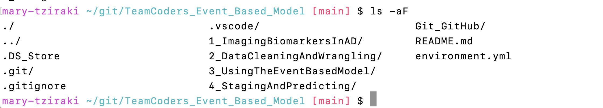

# Workflow for the Team Coder's workshop 
I would like to give you an opportunity to practice with me the git and GitHub interaction.

## For the team coder's event October 2022
We asked you to form teams. We helped you by suggesting people with a variety of skills to join each team as we want you to collaborate and learn from each other over this workshop.
We asked you to select your "team editor" who would act as a *rapporteur* and have the code of the workbooks on his repository.  

## The tasks
1. Set your SSH keys. Follow the instructions [**instructions**](set_SSH_keys.md) in this repository.

2. The "team editor" **forks** The TeamCoders_Event_Based_Model from the HealthBioscienceIDEAS organisation GitHub account. 

3. The team editor has to add the members as collaborators as I've shown at [**How to connect with GitHub**](Connect_git_local_with_GitHub.md) 

4. Each team member **clones** TeamCoders_Event_Based_Model  from the editor's repository. 
The editor has to go to the repository where the **green code tab** is and select the SSH option and copy the link and send it to the members 

Each team member, on their local machine, they have to go to any folder/directory they prefer, and clone by writing the following ( the URL will be different)
```
git clone git@github.com:mary-tziraki/TeamCoders_Event_Based_Model 
# Makes a  clone of an external repository in a local directory

```
Then go to the local repository and move into it

```
 cd TeamCoders_Event_Based_Model
 ```
 check what is listed with 
 ```
 ls -aF
 ```
 it will be like this
 

 Every folder has the / at the end. The other are files.
 You see that there is a .git/ folder (directory) that comes automatically from the GitHub and indicates that it is already  a git folder.

5. Now you are ready to collaborate. There is a Team.md file in the Git_GitHub directory, open that file (with a nano editor ) as I instruct at the [**Git Commands instructions**](git_command_line.md) and write your Team number and your names and from which institution you are coming from and whats your role.


5. Follow the instructions in the README.md file and install the Python environments we will use via Anaconda and Miniconda  
Type at yor command line 

```
conda env create -f environment.yml
```

4. Open the lab-books for every week 
You can use the Jupyter lab, type
```
Jupyter lab
```
The first week you will see and do the tasks of 1_Imaging Biomarkers in AD folder.


## **Practice with Mary**

If you want to practice git and GitHub with me, go to another directory, create a directory and clone my 'Practising_Git_GitHub" repository.  Please clone my repository using my SSH keys and type: 

```
git clone git@github.com:mary-tziraki/Practising_Git_GitHub.git
```

I'm happy to practice with you and show you how to collaborate without actually touching your TeamCoders directory if you feel uncomfortable 

Lets have some fun by writing Recipes (easy ones! 👩‍🍳 👩🏻‍🍳👩🏾‍🍳🧑🏻‍🍳🧑🏼‍🍳)

Happy Coding !! 😀 , Team Coders 👩‍💻👩🏽‍💻👩🏻‍💻👩‍💻🐼👨🏻‍💻👨‍💻👨🏽‍💻👨🏻‍💻

