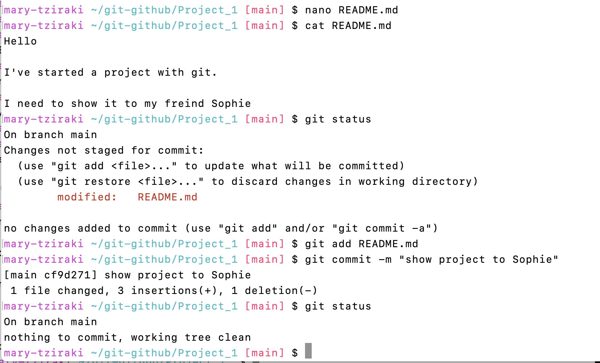
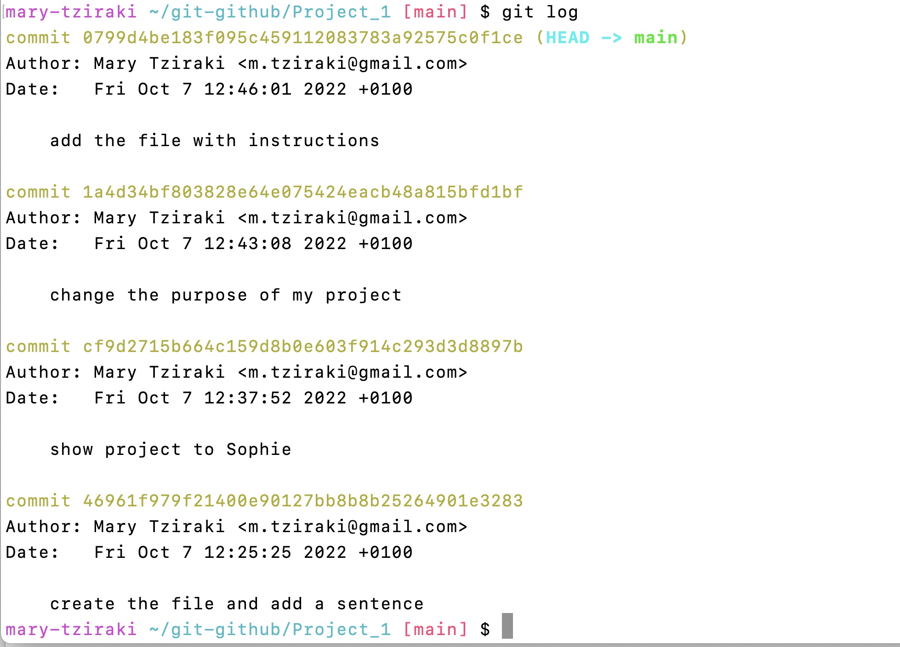
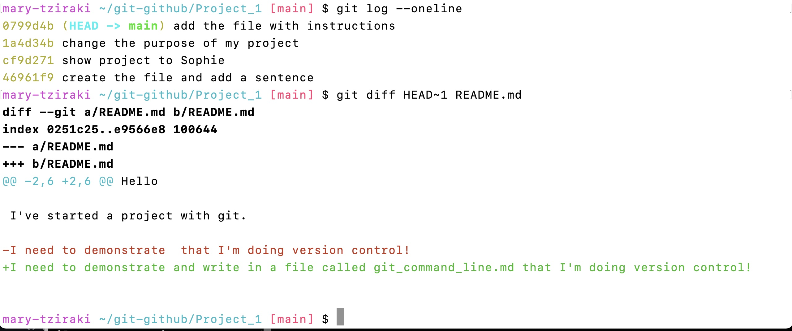
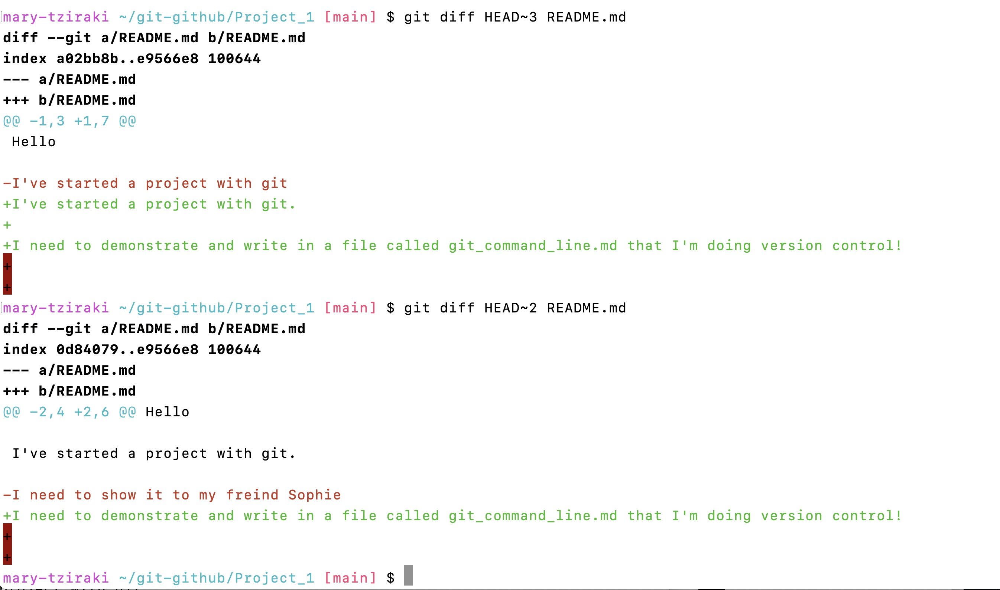

## This document shows you how to work with Git at the command line 
You need to launce the Terminal window (ot Bash shell or git Bash in windows)  and follow the commands below:
---

## 1) Start with Git
 Introducing yourself so git and GitHub knows who you are: 
Copy the following on your command line (terminal, bash shell) commands but not the comments that start with (#)

```
 $ git config --list # shows if you have done the initial git configurations  
```
Do you see anything? 
If not You need to tell git who you are, your email and a few settings  that would help you to follow the course.

```
$ git config --global user.name “Your Name”
$ git config --global user.email  “your_email@email.com”
$ git config --global core.editor "nano -w"
$ git config --global init.defaultBranch "main"
```

## 2)	Create the git repository and add a file.md into it


if you type **pwd** it shows where you are 
```
%pwd # shows you the path of the directory 
```
Go to any Folder (directory)  you have  by typing (ls -Fa) and then (cd YourPreferedFolder)

```
 ls -Fa
```
You see all the files and directories ( non-hidden and hidden with the . infront)
Then move to your preferred directory by 

```
 cd YourFolder 
```
and make a new directory called Project_1

```
 mkdir Project_1
```
Move into that subdirectory 


```
 cd Project_1
```
My example (not necessary the same for you, yours migh look different) 
I went from my homedirectory mary-tziraki to a subdirectory (pre-existing) called *git-github* and then I created (with mkdir) the Project_1 directory

My command line after **pwd** shows my path

```
 pwd
```
### Output
```
 /Users/mary-tziraki/git-github/Project_1
```

we have created a subdirectory with the path /Users/YOURNAME/YOUR_Pre_existing_Directory/Project_1
You are now in the Project_1 directory (folder)
### You need to make this directory a git repository
```
$ git init #  makes the folder that you are in a Git repository
```

```
 $ ls -a  # it will list all folders and files including the hidden ones (which start with . or .foldername/)
```
you will see a .git  which indicates that your directory (folder) has git and ready for version control.

**Output** 
```
.	..	.git
```


 **But be careful!** Running the git init command in the wrong directory will remove the entire Git history of a project you might want to keep. Therefore, always check your current directory using the command pwd and check if there is a .git directory by (ls -aF)

%pwd # shows you the path of the  directory 

If you want to create a file you type **touch** command 

```
touch README.md
```
If you want to edit it use the **nano** editor and if you want to see it the **cat** commands

```
$ nano README.md  # Editor for the command line. Edit README.md file
```

Open in the nano editor the README.md 
Write whatever you want, for example: "Hello

I've started a project with git."

Then save it with (^O)(Control-O) and exit with (^X)(Control-X) 

then to see the file type cat (filename)

```
$ cat README.md . # Shows the lines in the README.md file
```


## 3)	How to Stage the changes and how to commit into the repository Workflow commands
Lets see a figure that shows what we mean with staging 


You have worked (create a file, edited it and saved it) in the working directory.
TO do version control, you need to send it to the .git directory. To do so you need to add it one the STAGE area and then commit it
## Summary of the git commands to use in 3).

```
$ git  status # Checks the branch if there are commits and shows the status
$ git add    filename1 filename2 directory/    # inserts files in the staging area
$ git  commit –m “message -what we have changed” # saves the staged content as a new commit in the local  repository
$ nano README.md  # Editor for the command line. Edit README.md file
$ cat README.md. # Shows the lines in the README.md file
```


- **1st you checked the status** 
```
$ git  status # Checks the branch if there are commits and shows the status> You will see there if a file has been modified (in colour) and needs to be staged and committed.
```
**Output**
```
On branch main

No commits yet

Untracked files:
  (use "git add <file>..." to include in what will be committed)
	README.md

nothing added to commit but untracked files present (use "git add" to track)

 ```
 It says that you are in the "main" branch and you haven'y done any commits yet
 
The **untracked files** message means that there’s a file in the directory that Git isn’t keeping track of.
There’s a file in the directory that we have saved (modified) it in the working directory but not in git. The file is coloured !!
It tells you to use git add

We can tell Git to track the  file using **git add** then to put a 'Stamp' on it by **git  commit –m “message**  the commit **Don't Forget to write The Message!!!**

```
$ git add  README.md   # inserts files in the staging area, it could be many files( git add    filename1 filename2 directory/ )
$ git  commit –m “create the file and add a sentence” # saves the staged content as a new commit in the local  repository with a message

```
**Output**
```
[main (root-commit) 46961f9] create the file and add a sentence
 1 file changed, 3 insertions(+)
 create mode 100644 README.md
 ```
 
 That shows that I changed 1 file and add 3 lines (although I wrote in 2, it includes the empty lines). 
 The commit is given a encrypted unique number (46961f9) and has a message "create the file and add a sentence"
 
If you repeat you have the full circle of (edit, save, view, check status, add to stage and finally commit).

It is recommended to do another git status to check!

$ git  status # Checks the branch if there are commits and shows the status> You will see there if a file has been modified (in colour) and needs to be staged and committed.

**Output**
```
On branch main
nothing to commit, working tree clean
```
It says that there is nothing to commit, so everything is in the git repository and it is committed! 

**REPEAT** the following workflow to practice !! Make changes and commits  

```
nano README.md
```
```
cat README.md
```
```
$ git  status
```
```
git add  README.md
```

```
$ git  commit –m “message”
```
If you are doing it continuously you will create lots of changes with the relevant commits. A picture with my workflow
## Picture of my terminal



## 4)	How to see history and differences between versions:

A quick summary of the commands to use to observe the history and the differences between the files
### Summary of the commands 

- $ **git log**  # Displays ALL the information about the commits and the commit’s history 
- $ **git log --oneline**    # Displays only the essential information of the history and commits 
- $  **git diff HEAD~1 File.txt**# Displays the difference between the last commit HEAD and the commit before that HEAD~1
- $  **git checkout HEAD~1 File.txt**# Displays the difference between the last commit HEAD and the commit before that HEAD~1
- $  **git checkout f23bs45e File.txt**# Displays the difference between the last commit HEAD and the commit before that with the code (f23bs45e) You can find the codes of each commit if you type git log --oneline

### Demonstration 
```
git log # Displays ALL the information about the commits and the commit’s history 
```
## picture of my terminal
 

```
git log --oneline # Displays ALL the information about the commits and the commit’s history 
```
 
Everything is concise here and displays all the commits with. their messages and their unique number
HEAD is always the latest commit!!
HEAD ~ 1 :Is the previous version (it is like HEAD minus 1) commit and file!

To see the difference in the two latest versions  we use **git diff HEAD~1 README.md** 

```
git diff HEAD~1 README.md 
```
**Output**
```
diff --git a/README.md b/README.md
index 0251c25..e9566e8 100644
--- a/README.md
+++ b/README.md
@@ -2,6 +2,6 @@ Hello
 
 I've started a project with git.
 
-I need to demonstrate  that I'm doing version control!
+I need to demonstrate and write in a file called git_command_line.md that I'm doing version control!
 

```
It shows that I have subtract one line (-) and I have added another one (+) although I have changed few words it takes it as a whole line.If I want to see the changes in various stages I use the HEAD~2 (for two versions below) and the HEAD~3 (for three versions below).

 


#


