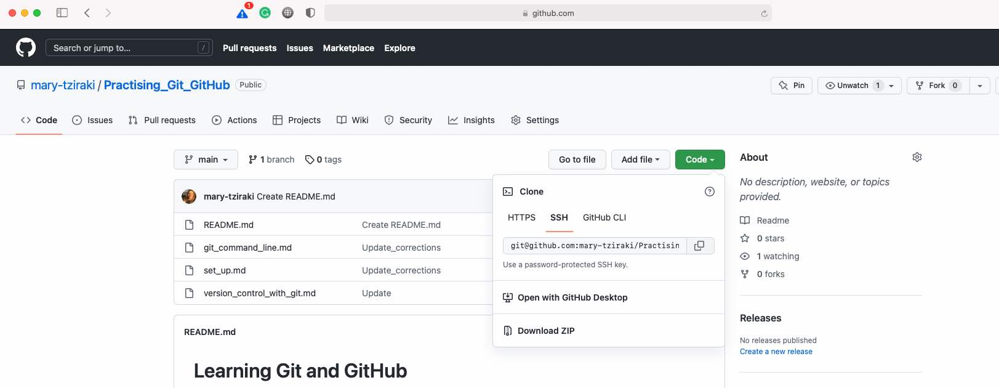

# SSH keys set up 

In order to connect with a remote repository (GitHub repository) we prefer to use a security protocol called  Secure Shell Protocol (SSH).
When you are in the remote repository click the Green Code tab  and select the SSH option(as in the picture) 



 SSH is a cryptographic network protocol that allows secure communication between computers using an otherwise insecure network.

 SSH uses what is called a key pair. This is two keys that work together to validate access. One key is publicly known and called the **public key** it is the one that you see at the GitHub repo , and the other key called the **private key** is kept private. 

 What I will do now is the minimum required to set up the SSH keys and add the public key to a GitHub account.

### Check if you have the SSH Keys install

 First run the list command to check what key pairs already exist on your computer.
 ```bash
 ls -al ~/.ssh
 ```
 Your output is going to look a little different depending on whether or not SSH has ever been set up on the computer you are using.
I have set my SSH keys and my output is 
### Output 


If you do not have SSH keys set your output will look like 

### Output 

```bash
 ls: cannot access '/c/Users/YOURNAME/.ssh': No such file or directory
 ```

If SSH has been set up on the computer you’re using, the public and private key pairs will be listed. The file names are either id_ed25519/id_ed25519.pub or id_rsa/id_rsa.pub depending on how the key pairs were set up.
Since they don’t exist on your computer, you need to follow  the commands bellow to create them.

##  Create an SSH key pair

Write the following commands with **your email address that you are connected to GitHub**

```bash
 ssh-keygen -t ed25519 -C "youremail@example.ia"
 ```

 If you are using a system that doesn’t support the Ed25519 algorithm, use: $ ssh-keygen -t rsa -b 4096 -C "your_email@example.com"


### Output
 ```bash
 Generating public/private ed25519 key pair.
Enter file in which to save the key (/c/Users/YOURNAME/.ssh/id_ed25519):
 ```

 We want to use the default file, so just press Enter.


 ### Output
 ```bash
Created directory '/c/Users/YOURNAME/.ssh'.
Enter passphrase (empty for no passphrase):

 ```

 Now, it is prompting you for a passphrase. If you are using a lab’s laptop that other people sometimes have access to, you want to create a passphrase. Regardless the use of the computer (private or shared ) you need to create the SSH keys to connect with the GitHub.
  Be sure to use something memorable or save your passphrase somewhere, **there is no “reset my password” option for SSH keys.**

  
 ### Output
 ```bash
Enter same passphrase again:

 ```
 After entering the same passphrase a second time, we receive the confirmation

 ### Output
 ```bash
Your identification has been saved in /c/Users/YOURNAME/.ssh/id_ed25519
Your public key has been saved in /c/Users/YOURNAME/.ssh/id_ed25519.pub
The key fingerprint is:
SHA256:SMSPIStNyA00KPxuYu94KpZgRAYjgt9g4BA4kFy3g1o youremail@example.com
The key's randomart image is:
+--[ED25519 256]--+
|^B== o.          |
|%*=.*.+          |
|+=.E =.+         |
| .=.+.o..        |
|....  . S        |
|.+ o             |
|+ =              |
|.o.o             |
|oo+.             |
+----[SHA256]-----+

 ```

 The “identification” is actually the private key. You should never share it. The public key is appropriately named. The “key fingerprint” is a shorter version of a public key.

Now that we have generated the SSH keys, we will find the SSH files when we check.

Check the ssh keys settings:

 ```bash
 ls -al ~/.ssh
 ```

### Output
 ```bash
drwxr-xr-x+ 116 YOURNAME  staff  3712  6 Oct 20:17 ..
-rw-r--r--    1 YOURNAME  staff    79  6 Oct 15:37 config
-rw-------    1 YOURNAME  staff   464  6 Oct 15:09 id_ed25519
-rw-r--r--    1 YOURNAME staff   101  9 Sep 15:09 id_ed25519.pub

 ```


## Copy the public key to GitHub

Now you have a SSH key pair and you can run this command to check if GitHub can read our authentication.
Write **git@github.com** an not your email

```bash
 ssh -T git@github.com
 ```

### Output
 ```bash
The authenticity of host 'github.com (192.30.255.112)' can't be established.
RSA key fingerprint is SHA256:nThbg6kXUpJWGl7E1IGOCspRomTxdCARLviKw6E5SY8.
This key is not known by any other names
Are you sure you want to continue connecting (yes/no/[fingerprint])? y
Please type 'yes', 'no' or the fingerprint: yes
Warning: Permanently added 'github.com' (RSA) to the list of known hosts.
git@github.com: Permission denied (publickey).
 ```

 Up to now , we forgot that we need to give GitHub our public key!

First, you need to copy the public key. Be sure to include the .pub at the end, otherwise you’re looking at the private key.
```bash
 cat ~/.ssh/id_ed25519.pub
 ```

### Output
```bash
 ssh-ed25519 AAAAC3NzaC1lZDI1NTE5AAAAIDmPSDTHW 1X0uu9wXek559gfn6UFNF69yZjChyBIU2qKI youremail@example.com

 ```
Now, going to GitHub.com, click on your profile icon in the top right corner to get the drop-down menu. Click “Settings,” then on the settings page on the left side at “Account settings” menu , click “SSH and GPG keys”.


You see there that you can have many SSH keys. It is recommended to have one in every machine you use.


  Click the “New SSH key” button on the right side. Now, you can add any title  ( My Lab Laptop), paste your SSH key into the field, and click the “Add SSH key” to complete the setup.

  

Now that we’ve set that up, let’s check our authentication again from the command line.

```bash
 ssh -T git@github.com
 ```

 ## Output

 ```bash
 Hi YOURNAME! You've successfully authenticated, but GitHub does not provide shell access.
 ```

 Good! This output confirms that the SSH key works as intended. You are now ready to push our work to the remote repository.